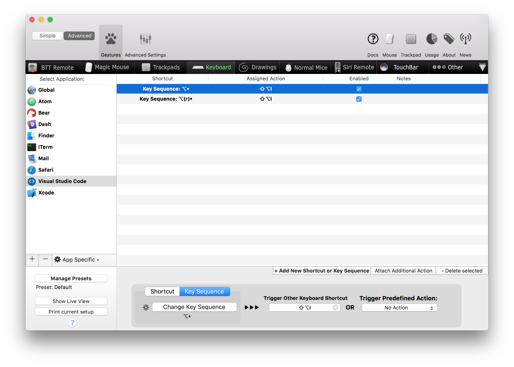
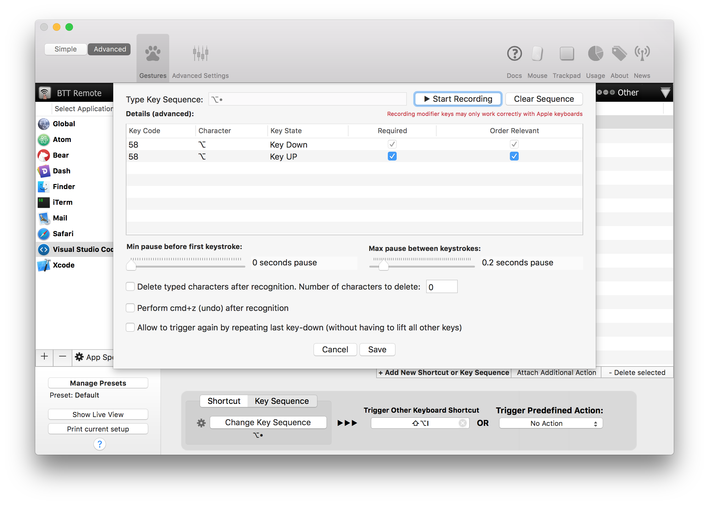

# Toggle Column Selection for [Visual Studio Code](http://code.visualstudio.com)

> Adds a [TextMate 2](https://macromates.com)-style `Toggle Column Selection` command to VSCode

## Features ##

- Converts a single contiguous selection into a column selection composed of multiple selections/cursors.
- Also works in the opposite direction, converting multiple selections/cursors into a single contiguous selection.

## Usage

1. Make a multi-line selection, idealy using your keyboard by holding the `SHIFT` key while using the arrow keys to move the cursor.
2. Invoke the `Toggle Column Selection` command from the Command Palette  or use the default keybinding (`OPTION/ALT`-`SHIFT`-`I`).

### Crank It To Eleven (aka Tap `OPTION` to Invoke)

> This section only works on Mac; if you know tools for Windows or Linux that let you trigger actions by simply tapping a modifier key, please let me know!

To truly mimic TextMate's implementation you'll want to trigger this command with a single tap of the `OPTION` key. Sadly VSCode won't allow you to do this. This is where [BetterTouchTool](https://www.boastr.net) comes in. Use BTT to set up a new Key Sequence that maps a single tap of the `OPTION` key to `OPTION`-`SHIFT`-`I`.

**BetterTouchTool TIPS:**

- Make sure you check the `REQUIRED` and `ORDER RELEVANT` boxes for the **KEY UP** state.
- BetterTouchTool treats the left and right `OPTION` keys as different keys so you'll likely want to create an entry for each key.
