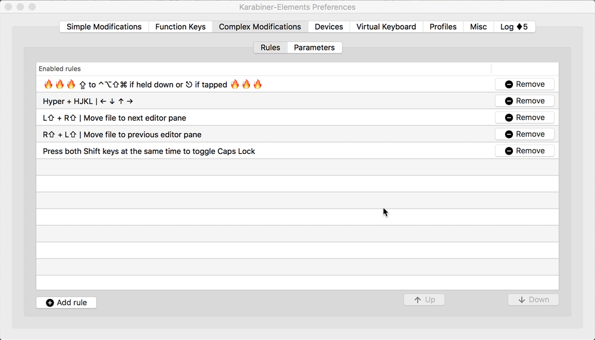

This JSON file can be installed by either:

1. Entering this URL in your browser: `karabiner://karabiner/assets/complex_modifications/import?url=https://raw.githubusercontent.com/erikphansen/vscode-toggle-column-selection/master/karabiner/option-toggle-column-selection-vscode.json`. This will prompt you to open Karabiner and install the rule.
2. Or saving `option-toggle-column-selection-vscode.json` in `~/.config/karabiner/assets/complex_modifications/`. It will then be available when you click the Add Rule button in the Complex Modifications tab, as shown below.

